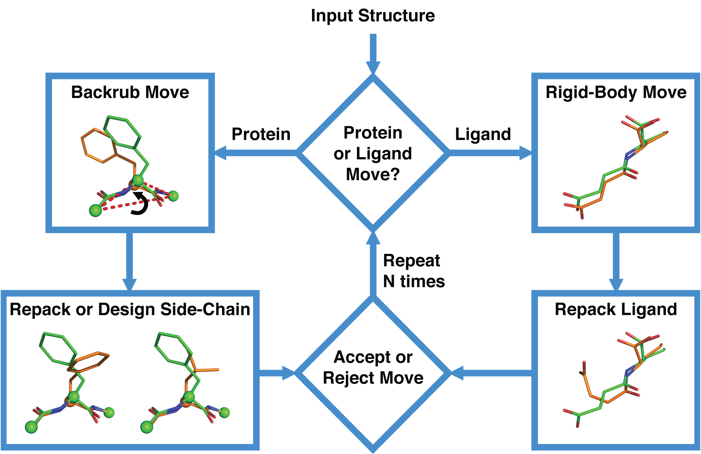
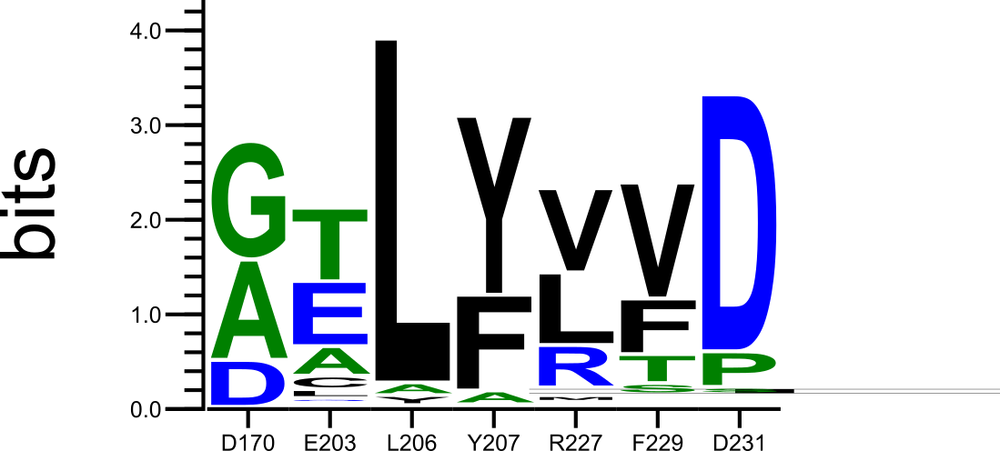
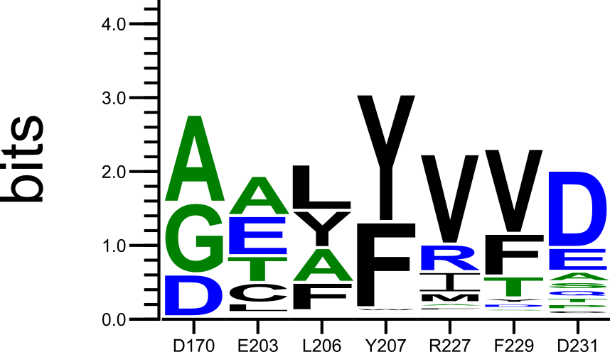

=======================
Coupled Moves Practical
=======================

Introduction
------------

In this activity, you will utilize the Coupled Moves [NO2015]_ protocol within Rosetta to find mutations capable of redesigning enzyme specificity for an alternate target ligand.

Coupled Moves utilizes a flexible backbone modeling approach, achieving a better performance than a comparable fixed backbone method for 16 out of 17 tested benchmark cases [NO2015]_.

Coupled Moves operates according as follows (Fig 3. from [NO2015]_):

Run Coupled Moves
-----------------

.. note::

   If you desire to use coupled_moves on your own system, you will need to prepare any input ligands according to the documentation at ``https://www.rosettacommons.org/docs/latest/rosetta_basics/preparation/preparing-ligands``

1. From within the coupled_moves .zip folder, open ``run.py`` in your text editor of choice.
#. Find the ``coupled_moves_path`` at the top of ``run.py`` and set it to the appropriate location of your compiled Rosetta coupled_moves binary.
#. Run ``python run.py``. The full command line call to each instance of Rosetta will be displayed, and will look something like this:

   ``/home/user/rosetta/rosetta_src_2017.45.59812_bundle/main/source/bin/coupled_moves.static.linuxgccrelease -s /home/coupled_moves/2O7B_HC4/2O7B_with_HC4.pdb -resfile /home/coupled_moves/2O7B_HC4/2O7B.resfile -extra_res_fa /home/coupled_moves/2O7B_HC4/HC4_from_2O7B.params -mute protocols.backrub.BackrubMover -ex1 -ex2 -extrachi_cutoff 0 -nstruct 1 -coupled_moves::mc_kt 0.6 -coupled_moves::initial_repack false -coupled_moves::ligand_mode true -coupled_moves::fix_backbone false -coupled_moves::bias_sampling true -coupled_moves::boltzmann_kt 0.6 -coupled_moves::bump_check true -extra_res_fa /home/kyleb/algosb/coupled_moves/2O7B_HC4/MDO_from_2O7B.params``

   Important flags explained:

   * ``-resfile`` is an input file that tells Rosetta which protein positions to design (sample side chain rotamers of any amino acid) or repack (only sample side chain rotamers of the wild type amino acid). For coupled moves, designable residues are usually chosen to be those in close proximity to the target ligand, and packable residues as any residues in close proximity to the design shell residues. See the `Rosetta documentation <https://www.rosettacommons.org/docs/latest/rosetta_basics/file_types/resfiles>`_ for more information on resfiles.
   * ``-ex1 -ex2 -extrachi_cutoff`` tell Rosetta's side chain packing algorithm to sample extra subrotamers for chi1 and chi2 angles of all side chains (`Packer documentation <https://www.rosettacommons.org/docs/latest/rosetta_basics/options/packing-options>`_)
   * ``-mute`` suppresses extraneous output from printing at the command line
   * ``-nstruct 1`` run one independent Monte Carlo trajectory, producing one final output structure
   * ``-coupled_moves::fix_backbone false`` can be set to ``true`` to compare coupled move's performance when the backrub sampling step is skipped.
   * ``-coupled_moves::boltzmann_kt 0.6`` the Boltzmann acceptance temperature
   * ``-coupled_moves::ligand_weight 1.0`` can be set to greater than 1.0 to upweight ligand-protein interactions

#. Output will be saved in a new directory named ``output``

Analysis
--------

Normally, you would run coupled_moves 20+ times for a single set of inputs in order to generate enough evaluated sequences for infromative output. In the interest of time, we have set ``run.py`` to create only one output structure. You can proceed with the rest of the activity by extracting ``tar -xf example_output.tgz`` in the current folder.

Python analysis
^^^^^^^^^^^^^^^

Three Python packages are required in order to run the analysis, and can be installed via pip: ``pip install numpy cogent weblogo``

.. TODO test this pip install

Run the analysis script as follows:

::

  python analyze_coupled_moves.py example_output/3HG5_A2G example_output/GLA

If you cannot get the analysis script to run successfully, example output can be found in ``example_output.tgz`` as ``example_output/analysis.txt``.

The analysis script will compare the distributions of output sequences for ``3HG5_A2G over 3HG5_GLA``, which are mutations enriched in the non-native substrate (A2G/N-acetyl-galactosamine) over the native substrate (GLA/galactose) in the wild type crystal structure (3HG5). Looking for **enrichment** of mutations in the mutant profile compared to the wild type profile helps identify specificity-switching mutations, as can be seen upon examination of the individual output sequence profiles:

Left: Sequence profile predicted by coupled moves for 3HG5 with its native substrate galactose. Right: Sequence profile predicted for 3HG5 and non-native substrate N-acetyl-galactosamine.

Structure analysis
^^^^^^^^^^^^^^^^^^

Using PyMOL (or your preferred protein visualization software of choice),  load the wild type crystal structure with the native substrate ligand (``3HG5_GLA/3HG5_with_GLA.pdb``) and the wild type crystal structure with non-native substrate (``3HG5_A2G/3HG5_with_A2G.pdb``). Focus your examination on the protein environment around each ligand, especially the residues that are designed: 170, 203, 206, 207, 227, 229, and 231.

Discussion questions
^^^^^^^^^^^^^^^^^^^^

* Why is enrichment a useful metric to find specificity switching mutations?
* After examination of the output sequence profiles and the structure cound to native and non-native substrates, which highly enriched mutations would you choose as most likely to produce the desired specificity switch?

.. TODO extra time - fixed backbone?

References
----------

.. [NO2015] Noah Ollikainen, René M. de Jong, and Tanja Kortemme. Coupling Protein Side-Chain and Backbone
   Flexibility Improves the Re-design of Protein-Ligand Specificity. *PLOS Comput Biol*, 11(9):e1004335,
   September 2015. ISSN 1553-7358. doi: 10.1371/journal.pcbi.1004335.
   URL http://journals.plos.org/ploscompbiol/article?id=10.1371/journal.pcbi.1004335

.. [CS2008] Colin A. Smith and Tanja Kortemme. Backrub-Like Backbone Simulation Recapitulates Natural Protein
   Conformational Variability and Improves Mutant Side-Chain Prediction. *Journal of Molecular Biology*, 380(4):
   742–756, July 2008. ISSN 0022-2836. doi: 10.1016/j.jmb.2008.05.023. URL http://www.sciencedirect.com/science/article/pii/S0022283608005779.
